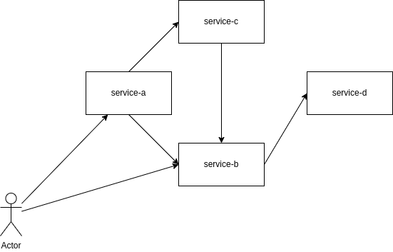

# Day 1 Tasks

Usahakan bisa diselesaikan dan di demo-kan. Hasil dari implementasi ini akan digunakan untuk tugas hari ke-2, dan hari ke-3 di minggu ini. Jika pekerjaan ini dirasa cukup sulit / memakan waktu lama, boleh dikerjakan secara `team`, silahkan berdiskusi, dan lakukan kerjasama untuk menyelesaikan.

## Memecah Monolithic Menjadi Microservices

1. Coba pelajari contoh aplikasi monolithic berikut ini secara menyeluruh: [monolithic-service-example](../monolithic-service-example).
2. Lakukan **analisis** untuk memecah aplikasi tersebut menjadi aplikasi microservices. Hasil analisis berupa suatu diagram sederhana yang menggambarkan dependensi antar service setelah di refactor menjadi monolithic. Coba gunakan https://app.diagrams.net. Simpan diagram dalam bentuk `.png`. Berikut merupakan contoh diagram yang dimaksud:



3. Lakukan implementasi coding untuk membuat aplikasi microservices dari hasil analisis kalian, dengan catatan:
    - **Minimal** service yang terbentuk adalah sebanyak 3 services.
    - Gunakan effort sedikit mungkin untuk memecah service tersebut
    - Gunakan `base` code / `boilerplate` yang digunakan pada aplikasi monolithic tersebut untuk membuat service baru jika dirasa mudah.
    - Setiap service simpan pada 1 directory tersendiri
    - Simpan semuanya ke dalam 1 repository di github kalian dengan nama repository: `jcc-microservices-example` yang di dalam nya terdiri dari beberapa folder service:
      ```
      jcc-microservices-example
        service-a/
          .
          .
        service-b/
        service-c/
        .
        .
        .
      ```
    - Kalian boleh menambahkan beberapa endpoint tambahan jika memang diperlukan.

4. Simpan diagram hasil analisis pada `README` di repository `jcc-microservices-example`.
5. Pastikan fungsionalitas setiap endpoint bisa berjalan 
6. Usahakan bisa diselesaikan dan di demo-kan. Hasil dari implementasi ini akan digunakan untuk tugas hari ke-2, dan hari ke-3 di minggu ini.
7. Seperti biasa, kalau mengalama kendala silahkan bikin issue di repo ini.
8. Good luck!


## Implementasi Failure Handling

1. Implementasikan penggunaan `retry with backoff` pada **salah satu** pemanggilan service
2. Implementasikan penggunaan `circuit breaker` pada **salah satu** pemanggilan service
3. Lakukan manual test untuk menjamin implementasi tersebut benar. Misal dengan cara: menambah sleep beberapa detik di salah satu endpoint yang dipanggil, atau mematikan salah satu service beberapa saat.

Catatan:
Silahkan gunakan beberapa library yang tersedia di internet. Misal http client yang digunakan adalah `axios` bisa mencari library / plugin `axios` yang bisa melakukan hal tersebut.
